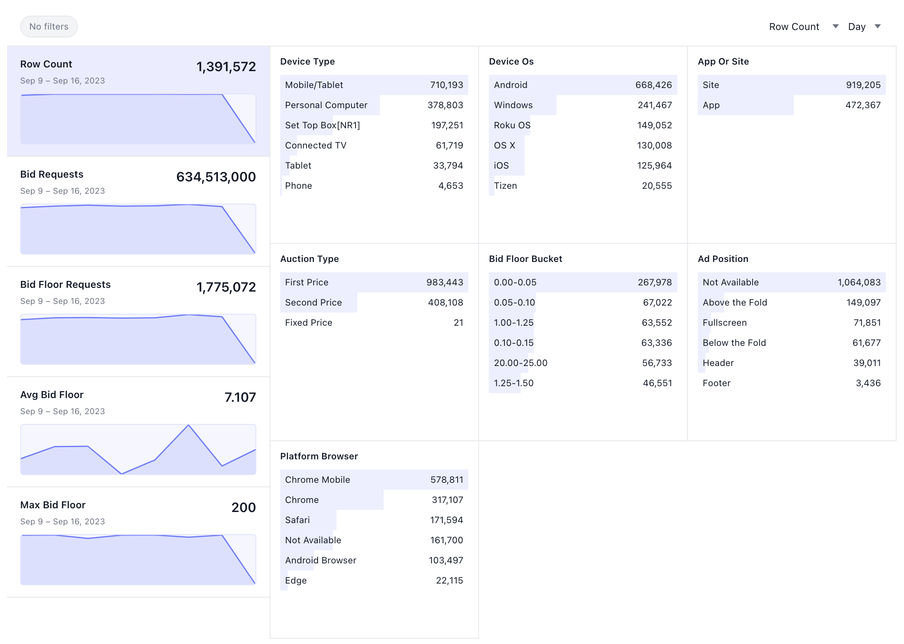

# Sidemantic

Sidemantic is an open-source semantic runtime. Define governed metrics once—or import the semantic models you already have—and query them consistently from SQL, the CLI, Python, HTTP, PostgreSQL clients, notebooks, BI tools, and AI agents.

- **Bring existing models:** Power BI TMDL/DAX, Cube, dbt MetricFlow, LookML, Hex, Rill, Superset, Omni, BSL, GoodData LDM, Snowflake Cortex, Malloy, OSI, AtScale SML, and ThoughtSpot TML
- **Or author natively:** concise YAML, semantic SQL DDL, or Python
- **Run on your warehouse:** DuckDB, MotherDuck, PostgreSQL, BigQuery, Snowflake, ClickHouse, Databricks, Spark SQL, and ADBC sources
- **Consume metrics anywhere:** semantic SQL, CLI, Python, HTTP/Arrow, PostgreSQL wire protocol, MCP, notebooks, TypeScript/WASM, and embedded analytics

[Documentation](https://sidemantic.com) | [GitHub](https://github.com/sidequery/sidemantic) | [Docker Hub](https://hub.docker.com/repository/docker/sidequery/sidemantic) | [Discord](https://discord.com/invite/7MZ4UgSVvF) | [Demo](https://sidemantic.com/demo) (50+ MB data download, runs in your browser with Pyodide + DuckDB)



Sidemantic ships Claude Code and Codex plugin metadata for two skills (`modeler` and `webapp-builder`). See [Agent Plugin](#agent-plugin) below to install.

Contributors working on browser surfaces should read the [UI architecture and canonical ownership map](docs/ui-architecture.md).

## 60-second quickstart

Create `models/orders.yml`:

```yaml
models:
  - name: orders
    sql: |
      select * from (values
        (1, 'paid',    120.00),
        (2, 'paid',     80.00),
        (3, 'pending',  50.00)
      ) as t(id, status, amount)
    primary_key: id
    dimensions:
      - name: status
        type: categorical
        sql: status
    metrics:
      - name: revenue
        agg: sum
        sql: amount
      - name: order_count
        agg: count
```

Query it directly—no database setup or package installation required:

```bash
uvx sidemantic query \
  "SELECT orders.status, orders.revenue, orders.order_count
   FROM orders
   ORDER BY orders.status" \
  --models ./models
```

```csv
status,revenue,order_count
paid,200.00,2
pending,50.00,1
```

From here, inspect generated warehouse SQL or open an interactive explorer:

```bash
# Compile without executing
uvx sidemantic query \
  "SELECT orders.status, orders.revenue FROM orders" \
  --models ./models --dry-run

# Explore in the terminal
uvx --from "sidemantic[workbench]" sidemantic workbench ./models
```

## Choose your path

- **Import existing semantic models:** point Sidemantic at a Cube, MetricFlow, LookML, Power BI, Malloy, Rill, or other supported project. Start with the [adapter guide](https://sidemantic.com/sidemantic/adapters).
- **Model tables or SQL:** continue with [models](https://sidemantic.com/sidemantic/models), [dimensions](https://sidemantic.com/sidemantic/dimensions), [metrics](https://sidemantic.com/sidemantic/metrics), and [relationships](https://sidemantic.com/sidemantic/relationships).
- **Query governed metrics:** use the [CLI](https://sidemantic.com/sidemantic/cli), [semantic SQL](https://sidemantic.com/sidemantic/query), or [Python API](https://sidemantic.com/sidemantic/python-api).
- **Explore data:** launch the terminal workbench, notebook widget, or browser UI.
- **Serve other tools:** expose models over the HTTP API, PostgreSQL wire protocol, or MCP server.

Install Sidemantic in a project with `uv add sidemantic`. Optional features are packaged as extras: `malloy`, `dax`, `workbench`, `widget`, `api`, and `serve`.

## DAX And TMDL

DAX/TMDL support lives behind the `dax` extra because it includes a native Rust parser:

```bash
uv add "sidemantic[dax]"
```

Native Sidemantic YAML can preserve DAX expression source text for Power BI interoperability:

```yaml
models:
  - name: sales
    table: sales
    primary_key: id
    dimensions:
      - name: doubled_amount
        type: numeric
        dax: "'sales'[amount] * 2"
    metrics:
      - name: revenue
        dax: "SUM('sales'[amount])"
```

Power BI TMDL projects can be loaded from a project root or `definition/` folder. Embedded DAX measures, calculated columns, calculated tables, relationships, and TMDL passthrough metadata are parsed and preserved in model metadata:

```python
from sidemantic import SemanticLayer, load_from_directory

layer = SemanticLayer(connection="duckdb:///warehouse.duckdb")
load_from_directory(layer, "powerbi_project/")
print(layer.describe_models(["Sales"]))
```

TMDL can also round-trip back to disk:

```python
from sidemantic.adapters.tmdl import TMDLAdapter

TMDLAdapter().export(layer.graph, "exported_tmdl/")
```

## CLI

```bash
# Query as a human-readable table (also supports csv, json, and jsonl)
sidemantic query "SELECT revenue FROM orders" --db data.duckdb --format table

# Interactive workbench (TUI with SQL editor + charts)
uvx --from "sidemantic[workbench]" sidemantic workbench models/ --db data.duckdb

# PostgreSQL server (connect Tableau, DBeaver, etc.)
uvx --from "sidemantic[serve]" sidemantic server postgres models/ --port 5433

# HTTP API server (JSON or Arrow)
uvx --from "sidemantic[api]" sidemantic server api models/ --port 4400 --auth-token-file .secrets/api-token

# Validate definitions
sidemantic validate models/

# Model info
sidemantic info models/

# Pre-aggregation recommendations
sidemantic preagg recommend --db data.duckdb

# Migrate SQL queries to semantic layer
sidemantic migrate generate legacy/ --output output/
```

See [the CLI contract](docs/cli.md) for output formats, `--plain`, quiet/verbose
diagnostics, option placement, terminal behavior, environment precedence,
stdin/stdout, exit codes, debugging, and secure credential input.

## Demos

**Workbench** (TUI with SQL editor + charts):
```bash
uvx --from "sidemantic[workbench]" sidemantic workbench --demo
```

**PostgreSQL server** (connect Tableau, DBeaver, etc.):
```bash
uvx --from "sidemantic[serve]" sidemantic server postgres --demo --port 5433
```

**HTTP API server** (JSON or Arrow):
```bash
uvx --from "sidemantic[api]" sidemantic server api --demo --port 4400
```

**Colab notebooks:**

[](https://colab.research.google.com/github/sidequery/sidemantic/blob/main/examples/notebooks/sidemantic_sql_duckdb_demo.ipynb) SQL + DuckDB

[](https://colab.research.google.com/github/sidequery/sidemantic/blob/main/examples/notebooks/lookml_multi_entity_duckdb_demo.ipynb) LookML multi-entity

**SQL syntax:**
```bash
uv run https://raw.githubusercontent.com/sidequery/sidemantic/main/examples/sql/sql_syntax_example.py
```

**Comprehensive demo:**
```bash
uv run https://raw.githubusercontent.com/sidequery/sidemantic/main/examples/advanced/comprehensive_demo.py
```

**Symmetric aggregates:**
```bash
uv run https://raw.githubusercontent.com/sidequery/sidemantic/main/examples/features/symmetric_aggregates_example.py
```

**Superset with DuckDB:**
```bash
git clone https://github.com/sidequery/sidemantic.git && cd sidemantic
uv run examples/superset_demo/run_demo.py
```

**Cube Playground:**
```bash
git clone https://github.com/sidequery/sidemantic.git && cd sidemantic
uv run examples/cube_demo/run_demo.py
```

**Rill Developer:**
```bash
git clone https://github.com/sidequery/sidemantic.git && cd sidemantic
uv run examples/rill_demo/run_demo.py
```

**OSI (complex adtech semantic model):**
```bash
git clone https://github.com/sidequery/sidemantic.git && cd sidemantic
uv run examples/osi_demo/run_demo.py
```

**OSI widget notebook (percent-cell Python notebook):**
```bash
git clone https://github.com/sidequery/sidemantic.git && cd sidemantic
uv run examples/osi_demo/osi_widget_notebook.py
```

See `examples/` for more.

## Core Features

- SQL query interface with automatic rewriting
- Automatic joins across models
- Multi-format adapters (Cube, MetricFlow, LookML, Hex, Rill, Superset, Omni, BSL, GoodData LDM, OSI, AtScale SML, ThoughtSpot TML, Graphene GSQL)
- SQLGlot-based SQL generation and transpilation
- Pydantic validation and type safety
- Pre-aggregations with explicit routing
- Predicate pushdown for faster queries
- Segments and metric-level filters
- Jinja2 templating for dynamic SQL
- PostgreSQL wire protocol server for BI tools
- HTTP API with JSON and Arrow IPC responses

## Multi-Format Support

Auto-detects: Sidemantic (SQL/YAML), Power BI TMDL, Cube, MetricFlow (dbt), LookML, Hex, Rill, Superset, Omni, BSL, GoodData LDM, OSI, AtScale SML, ThoughtSpot TML, Graphene GSQL

```bash
sidemantic query "SELECT revenue FROM orders" --models ./my_models
```

```python
from sidemantic import SemanticLayer, load_from_directory

layer = SemanticLayer(connection="duckdb:///data.duckdb")
load_from_directory(layer, "my_models/")  # Auto-detects formats
```

## Databases

| Database | Status | Installation |
|----------|:------:|--------------|
| DuckDB | ✅ | built-in |
| MotherDuck | ✅ | built-in |
| PostgreSQL | ✅ | `uv add sidemantic[postgres]` |
| BigQuery | ✅ | `uv add sidemantic[bigquery]` |
| Snowflake | ✅ | `uv add sidemantic[snowflake]` |
| ClickHouse | ✅ | `uv add sidemantic[clickhouse]` |
| Databricks | ✅ | `uv add sidemantic[databricks]` |
| Spark SQL | ✅ | `uv add sidemantic[spark]` |

## Docker

The published image is [`sidequery/sidemantic`](https://hub.docker.com/r/sidequery/sidemantic) on Docker Hub. Mount your models directory as a volume at `/app/models`:

```bash
docker run -p 5433:5433 -v ./models:/app/models sidequery/sidemantic
```

Demo mode (built-in sample data, no volume needed):

```bash
docker run -p 5433:5433 sidequery/sidemantic --demo
```

See [`examples/docker/`](examples/docker/) for MCP mode, env vars, building from source, and integration test services.

For Cloudflare Worker + Container deployment, see [`examples/cloudflare_containers/`](examples/cloudflare_containers/).

## HTTP API

Start the API server:

```bash
uvx --from "sidemantic[api]" sidemantic server api models/ --db data.duckdb --port 4400 --auth-token-file .secrets/api-token
```

Compile a structured semantic query:

```bash
curl -s http://localhost:4400/compile \
  -H "Authorization: Bearer secret" \
  -H "Content-Type: application/json" \
  -d '{"dimensions":["orders.status"],"metrics":["orders.total_amount"]}'
```

Run a structured query as JSON:

```bash
curl -s http://localhost:4400/query \
  -H "Authorization: Bearer secret" \
  -H "Content-Type: application/json" \
  -d '{"dimensions":["orders.status"],"metrics":["orders.total_amount","orders.order_count"]}'
```

Run a structured query as Arrow IPC:

```bash
curl -s http://localhost:4400/query \
  -H "Authorization: Bearer secret" \
  -H "Accept: application/vnd.apache.arrow.stream" \
  -H "Content-Type: application/json" \
  -d '{"metrics":["orders.order_count"]}' \
  > result.arrow
```

Execute rewritten SQL over HTTP:

```bash
curl -s http://localhost:4400/sql \
  -H "Authorization: Bearer secret" \
  -H "Content-Type: application/json" \
  -d '{"query":"SELECT status, total_amount FROM orders ORDER BY status"}'
```

## Agent Plugin

Sidemantic ships a [plugin bundle](plugins/sidemantic/) with Claude Code and Codex metadata for two skills:

- **`modeler`** — build, validate, and query semantic models
- **`webapp-builder`** — generate analytics webapps from your models

**Install in Claude Code:**

```bash
claude plugin marketplace add sidequery/sidemantic && claude plugin install sidemantic@sidequery
```

**Install in Codex:**

```bash
codex plugin marketplace add sidequery/sidemantic && codex plugin add sidemantic@sidequery
```

**Use a local clone while developing:**

```bash
claude --plugin-dir ./plugins/sidemantic
codex plugin marketplace add . && codex plugin add sidemantic@sidequery
```

The Claude Code plugin manifest lives at `plugins/sidemantic/.claude-plugin/plugin.json`, and its marketplace lives at `.claude-plugin/marketplace.json`.

The Codex plugin manifest lives at `plugins/sidemantic/.codex-plugin/plugin.json`, and its repo-local marketplace lives at `.agents/plugins/marketplace.json`.

The skills also work with other `SKILL.md`-compatible agents by pointing them at `plugins/sidemantic/skills/`.

## How mature is Sidemantic?

Sidemantic is an ambitious but young semantic layer project. You could encounter rough patches, especially with the more exotic features like converting between semantic model formats or serving semantic layers via the included Postgres protocol server.

## Testing

```bash
uv run pytest -v
```

This prints line coverage for `sidemantic` with missing lines in the terminal.
